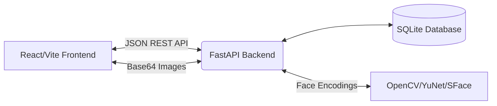

# 📋 Smart Attendance System

An advanced, full-stack web application designed to revolutionize classroom attendance. This system eliminates manual roll-calling by utilizing **Facial Biometrics** and **QR Code Check-ins**, and offers a fully hands-free experience through an integrated **AI Command Assistant**.

---

## 🌟 Introduction

The Smart Attendance System bridges the gap between traditional classroom management and modern automation. 

It provides two primary interfaces:
1. **Teacher Portal**: A powerful dashboard for managing students, generating QR access tokens, enrolling facial biometrics, monitoring live attendance sessions, and controlling the entire application via natural language commands.
2. **Student Portal**: A self-service interface where students can log in, view their attendance history, and check into active sessions by scanning a teacher-granted QR token.

---

## ✨ Core Features

### 👩‍🏫 Teacher Portal
*   **🤖 AI Command Assistant**: A floating, draggable, glassmorphic widget that provides **zero-click** control over the entire application. It understands 35+ natural language intents (e.g., *"start attendance"*, *"add student John Doe roll 123"*, *"register biometrics for 123"*), auto-fills forms, handles confirmation flows, and triggers actions programmatically.
*   **⏱️ Session Management**: Start and stop real-time attendance sessions. A live timer tracks the duration of the current class.
*   **📷 Facial Biometric Registration & Scanning**: 
    *   **Enrollment**: Guided 3-pose (Front, Left, Right) facial capture to build a 128-D vector profile.
    *   **Auto-Marking**: Real-time webcam scanning using Deep Learning (YuNet/SFace) to detect faces, match them against the database, and mark students present automatically.
*   **🔲 QR Code Access System**: Generate dynamic, unique QR codes for specific students. Students must scan these codes to check themselves in, preventing proxy attendance.
*   **📊 Live & Historical Analytics**: View real-time "Current Status" of who is present/absent. Browse and export archived sessions from previous dates.
*   **👥 Member Management**: Full CRUD capabilities for the student roster, including bulk viewing via the Attendance Sheet.
*   **🔐 Password Management**: Built-in credential reset flows for both teacher and student accounts.

### 🧑‍🎓 Student Portal
*   **Check-In Flow**: Students log in, click "Mark Attendance", and scan the active session's QR code.
*   **Dashboard**: A personalized view showing total attendance percentage and past session history.

---

## 🏗️ Architecture & System Flow

The application follows a decoupled client-server architecture:



1. **Frontend (React)**: Handles state, webcam streams (via WebRTC), UI rendering, and natural language command parsing.
2. **Backend (FastAPI)**: Manages database transactions, authentication logic, and executes the heavy lifting for facial feature extraction and distance matching using OpenCV deep learning models.
3. **Event-Driven Command System**: The AI assistant on the frontend uses an event bus (`window.dispatchEvent`) to communicate with individual React components, allowing a decoupled "command → confirm → execute" flow for complex forms.

---

## 🛠️ Tech Stack

| Layer | Technology |
|---|---|
| **Frontend Framework** | React 19, React Router v7, Vite 7 |
| **Frontend Styling** | Vanilla CSS, Glassmorphism, CSS Modules |
| **QR Handling** | `qrcode.react` (generation), `jsqr` (scanning) |
| **HTTP Client** | Axios |
| **Backend Framework** | Python, FastAPI, Uvicorn |
| **Database** | SQLite3 via SQLAlchemy ORM |
| **Computer Vision** | OpenCV (`opencv-python-headless`), NumPy |
| **Deep Learning Models** | YuNet (Face Detection), SFace (Feature Embedding) |
| **Data Validation** | Pydantic |

---

## 📁 Comprehensive Directory Structure

### 1. `teacher-portal/` (Frontend)

The frontend is built with React and Vite, structured into pages, components, and global utilities.

```text
teacher-portal/
├── src/
│   ├── api/                        # Axios HTTP client wrappers
│   │   ├── client.js               # Base Axios instance & interceptors
│   │   ├── attendanceApi.js        # API calls for sessions & marking
│   │   ├── biometricApi.js         # API calls for face registration/scanning
│   │   ├── membersApi.js           # API calls for CRUD on students
│   │   └── errorUtils.js           # Standardized error parsing for UI toasts
│   │
│   ├── command/                    # 🤖 AI Command Assistant Subsystem
│   │   ├── CommandController.jsx   # Floating Chat UI, drag logic, confirm/cancel state
│   │   ├── commandParser.js        # NLP engine: maps text to Intents and extracts parameters
│   │   └── commandExecutor.js      # Translates Intents into API calls or CustomEvents
│   │
│   ├── pages/                      # Top-level route components
│   │   ├── auth/
│   │   │   └── LoginSwitcher.jsx   # Tabbed login screen for Teacher/Student
│   │   └── student/
│   │       ├── StudentDashboard.jsx# Student-facing attendance stats
│   │       └── StudentScanner.jsx  # Student-facing QR code reader
│   │
│   ├── teacher/                    # Teacher-facing application
│   │   ├── TeacherDashboard.jsx    # Main Layout wrapper, holds global state & event listeners
│   │   ├── Navbar.jsx              # Top navigation bar
│   │   ├── Sidebar.jsx             # Left-side navigation menu
│   │   └── components/             # Functional views for the Teacher portal
│   │       ├── AddMember.jsx       # Form to add new students (listens to voice auto-fill)
│   │       ├── RemoveMember.jsx    # Form to delete students (listens to voice auto-fill)
│   │       ├── CurrentStatus.jsx   # Live table of attendees in the active session
│   │       ├── PreviousStatus.jsx  # Calendar/history view of archived sessions
│   │       ├── QRGenerator.jsx     # UI to generate and grant QR access to students
│   │       ├── WebcamScanner.jsx   # Live facial recognition feed (draws bounding boxes)
│   │       ├── BiometricRegistration.jsx # 3-pose face capture wizard
│   │       ├── Sheet.jsx           # Tabular view of all registered students
│   │       ├── VectorSheet.jsx     # Debug view showing raw 128-D vector stats
│   │       ├── Timer.jsx           # Session duration clock
│   │       └── PasswordReset.jsx   # Forms to reset teacher/student passwords
│   │
│   ├── utils/                      # LocalStorage and helper functions
│   │   ├── authStorage.js          # JWT/Token management
│   │   ├── timerStorage.js         # Persists timer state across page reloads
│   │   └── membersStorage.js       # Local caching for member lists
│   │
│   ├── App.jsx                     # React Router definition
│   ├── main.jsx                    # React entry point
│   ├── config.js                   # Environment variables (API_BASE_URL)
│   └── index.css                   # Global CSS variables and resets
```

### 2. `attendance-backend/` (Backend)

A FastAPI application that handles business logic, database ORM, and computer vision processing.

```text
attendance-backend/
├── main.py                   # FastAPI entry point, CORS config, and API route definitions
├── models.py                 # SQLAlchemy declarative base (Database Schema definitions)
├── schemas.py                # Pydantic models for Request/Response validation
├── crud.py                   # Core business logic and database queries (Create/Read/Update/Delete)
├── database.py               # SQLite engine creation and session factory
├── config.py                 # Environment configuration loader
├── models_download.py        # Utility script to auto-download YuNet/SFace ONNX models
├── server_launcher.py        # Utility to programmatically launch Uvicorn
├── attendance.db             # SQLite database file (auto-generated)
├── requirements.txt          # Python dependencies
└── models/                   # Directory where ONNX deep learning models are cached
```

---

## 🗄️ Database Schema (`models.py`)

The application uses SQLite, heavily leveraging relational mapping:

| Table | Description |
|---|---|
| `teachers` | Teacher authentication credentials. |
| `members` | The core student roster (`roll_no` is the primary key). Contains name, department, and year. |
| `student_auth` | Student login credentials, linked to `members` via foreign key. |
| `attendance_sessions` | Tracks active and archived sessions (`start_time`, `end_time`, `total_present`, `is_archived`). |
| `attendance` | Junction table logging which student attended which session, including a timestamp. |
| `qr_codes` | Tracks generated QR tokens, mapping a specific QR string payload to a student. |
| `biometric_vectors` | Stores the facial embedding arrays as JSON text. Each student can have multiple stored poses (front, left, right). |

---

## 📡 API Reference

Below are the core REST endpoints exposed by `main.py`:

**Authentication**
*   `POST /login/teacher` — Authenticate admin.
*   `POST /login/student` — Authenticate student.
*   `POST /teacher/reset-password` & `POST /student/reset-password`

**Members (Students)**
*   `GET /members` — List all enrolled students.
*   `POST /members` — Register a new student.
*   `DELETE /members/{roll_no}` — Remove a student.

**Attendance & Sessions**
*   `POST /attendance/session/start` — Initialize a new session.
*   `POST /attendance/session/stop` — Finalize and archive the active session.
*   `GET /attendance/current` — Get attendees for the active session.
*   `GET /attendance/history` — Get paginated historical records.
*   `POST /attendance/mark` — Manually mark a student present.

**Computer Vision (Biometrics)**
*   `POST /biometric/register` — Receives Base64 images, extracts 128-D vectors, and saves to DB.
*   `POST /biometric/scan` — Receives a live Base64 frame, detects faces, compares against stored vectors, and auto-marks attendance if a match > 0.65 similarity is found.

**QR System**
*   `POST /qr` — Save a newly generated QR code payload to the DB.
*   `POST /qr/grant-access` — Grants a specific student permission to use the QR scanner.
*   `GET /qr/check-access/{roll_no}` — Verifies if a student's scanned QR is valid and authorized for the current session.

---

## 🤖 Deep Dive: AI Command System

The application features a built-in Natural Language Processing (NLP) system designed to make the teacher portal 100% operable without a mouse or keyboard.

### How it works:
1. **Input**: The user types a command into the floating `CommandController.jsx` widget (or eventually, audio is piped via Speech-to-Text).
2. **Parsing (`commandParser.js`)**: The raw text is normalized and checked against a library of keyword matrices. It extracts the `INTENT` (e.g., `ADD_STUDENT`) and parameters (e.g., `{ name: "John", rollNo: "123" }`).
3. **Execution (`commandExecutor.js`)**: Based on the intent, the executor performs one of three actions:
   *   **Navigates** to the correct page via React Router.
   *   **Dispatches a CustomEvent** (e.g., `window.dispatchEvent('command-fill-add-member')`). The React component listening to this event intercepts it and auto-fills its internal state.
   *   **Queues a Confirmation**: For destructive actions (deleting data) or form submissions, the executor returns a `requiresConfirmation` flag. The controller displays a confirmation bubble.
4. **Confirmation Flow**: The user says `"confirm"` or `"yes"`. The parser recognizes the `CONFIRM` intent, and the controller executes the queued action (like firing a simulated form submit event), completing the loop completely hands-free.

---

## 🚀 Installation & Setup

### Prerequisites
*   **Python 3.10+**
*   **Node.js 18+** & **npm**

### 1. Backend Setup

```bash
cd attendance-backend

# Create and activate a virtual environment
python -m venv venv
# On Mac/Linux: source venv/bin/activate
# On Windows: venv\Scripts\activate

# Install dependencies (FastAPI, OpenCV, SQLAlchemy, etc.)
pip install -r requirements.txt

# Start the server (models will auto-download on first run)
uvicorn main:app --reload --host 0.0.0.0 --port 8000
```
*Note: The default Teacher credentials are **admin** / **admin**.*

### 2. Frontend Setup

```bash
cd teacher-portal

# Install dependencies
npm install

# Start the development server
npm run dev
```
Navigate to `http://localhost:5173` in your browser.

---

## 💡 Usage Walkthrough

1. **Log in** as a teacher using `admin` / `admin`.
2. **Add Students**: Open the AI Assistant (bottom right) and type: `"add student Jane Doe roll 22CS101"`. Say `"confirm"` when prompted.
3. **Enroll Face**: Type `"register biometrics for 22CS101"`. The app will navigate, fill the roll number, and automatically trigger the 3-pose camera sequence. Look at the camera as instructed.
4. **Start Class**: Type `"start attendance"`. The session timer begins.
5. **Mark Attendance (Face)**: Navigate to Webcam Scanner. The camera will detect Jane's face and automatically mark her present.
6. **Mark Attendance (QR)**: Type `"grant qr access to 22CS101"`. Jane can log into the Student Portal on her phone and scan the teacher's screen to mark her own attendance.
7. **End Class**: Type `"stop attendance"` to archive the session. You can review it later in the Previous Sessions tab.
